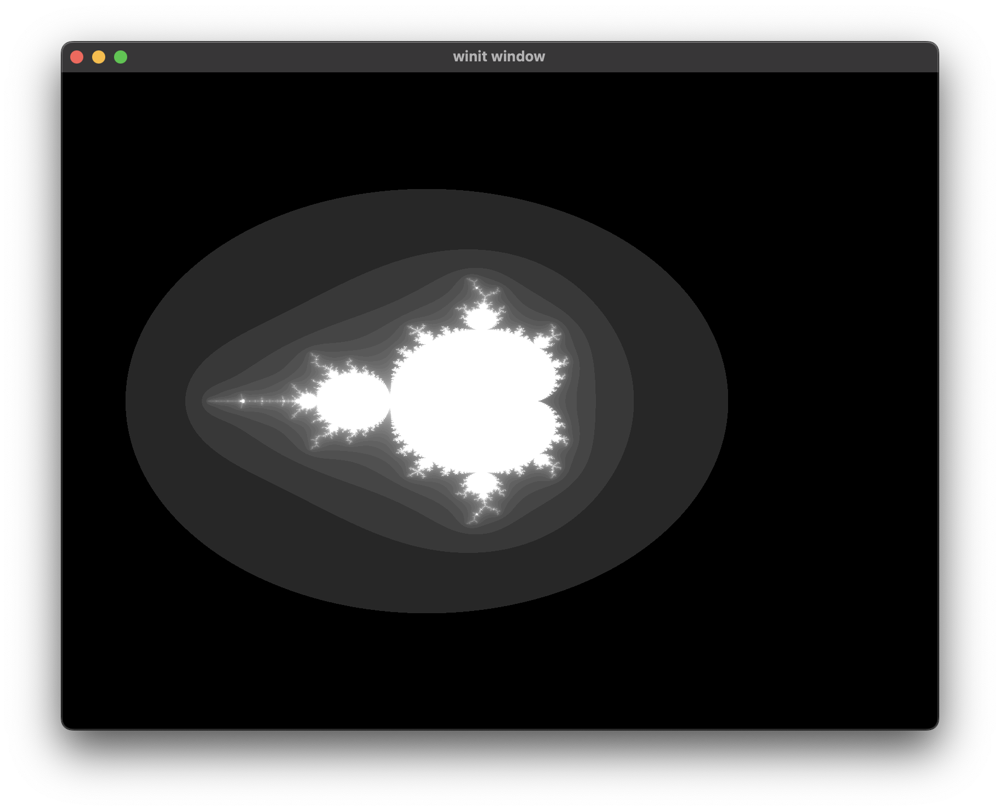
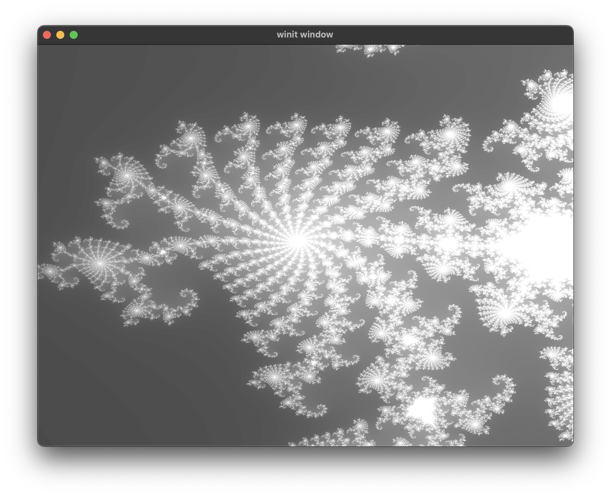

# uniform-values

Creates a window which displays a grayscale render of the [Mandelbrot set](https://en.wikipedia.org/wiki/Mandelbrot_set). Pressing the arrow keys will translate the set and scrolling the mouse wheel will zoom in and out. If the image appears too 'bright', it may be because you are using too few iterations or 'samples'. Use U and D to increase or decrease respectively the max number of iterations used. Make sure to play around with this too to get an optimally photogenic screen cap. The window can be resized and pressing ESC will close the window. Explore the Mandelbrot set using the power of uniform variables to transfer state from the main program to the shader!

### Limitations
At some point in exploring the fractal, you may discover there is actually a resolution; if you zoom to deep, things become weirdly pixilated. Unfortunately, the relatively basic shader is currently limited by the faults of 32-bit floating point precision. As much as I'd like to upgrade to 64-bit floats, the support in WGSL for f64's is limited and you can't even cast to one as of time of writing. Still pretty cool though.

## Screenshots

